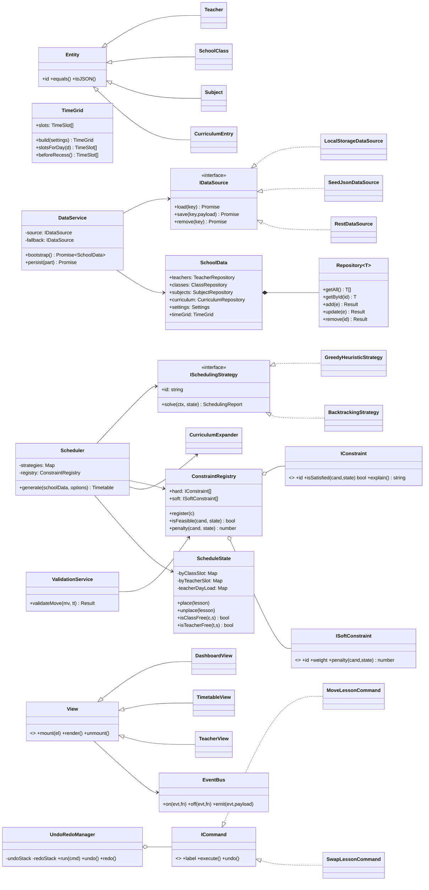

# ChronoSched — Architecture & Design Specification

> **Status:** Design phase (v1.0)
> **Stack:** HTML5 · CSS3 · Vanilla ES2022 modules · JSON · LocalStorage
> **Deploy target:** GitHub Pages (static, no backend)

---

## 0. Design Goals

| Goal | Mechanism |
|---|---|
| Maintainable for years | Strict layering, one class per file, documented public API |
| Extensible scheduling | Strategy + Constraint Registry (add rules without editing the solver) |
| Backend-ready | All data access behind async `IDataSource`; swap LocalStorage → REST |
| Testable | Domain + services have **zero** DOM references |
| Performant | Indexed occupancy maps, virtualised/diffed rendering, no full re-renders |

### The one non-negotiable rule

**Dependencies point inward.**

```
ui/  ──▶  services/  ──▶  domain/  ──▶  core/
 │                            ▲
 └──▶ managers/ ─────────────-┘
```

`domain/` may not import from `services/` or `ui/`.
`services/` may not import from `ui/`.
`ui/` never touches `localStorage` or `fetch` directly.

Violating this is the fastest way to make the project unmaintainable, so it is enforced by review and by an ESLint `no-restricted-imports` rule (optional dev-time only).

---

## 1. Folder Structure

```
ChronoSched/
├── index.html                     # Single shell page; app mounts into #app-root
├── .nojekyll                      # Required: GitHub Pages must not run Jekyll
├── README.md
├── docs/
│   ├── ARCHITECTURE.md            # This file
│   ├── SCHEDULING.md              # Algorithm deep-dive
│   └── DATA_SCHEMA.md             # JSON contracts + versioning/migrations
│
├── css/
│   ├── tokens.css                 # Design tokens (CSS custom properties) — SSOT for design
│   ├── theme-light.css            # Token values, light
│   ├── theme-dark.css             # Token values, dark
│   ├── base.css                   # Reset, typography, layout primitives
│   ├── components.css             # Buttons, cards, inputs, tables, modals, toasts
│   └── views.css                  # View-specific layout (dashboard, grid, editors)
│
├── vendor/                        # Vendored 3rd-party libs (no CDN — offline-safe)
│   ├── xlsx.full.min.js           # SheetJS — Excel import/export
│   ├── jspdf.umd.min.js           # jsPDF — PDF export
│   └── jspdf.plugin.autotable.js
│
├── data/                          # Seed JSON shipped with the app (read-only)
│   ├── settings.seed.json
│   ├── teachers.seed.json
│   ├── classes.seed.json
│   ├── subjects.seed.json
│   └── curriculum.seed.json
│
└── js/
    ├── main.js                    # Composition root — the ONLY place that `new`s things
    │
    ├── core/                      # Framework-agnostic primitives (no domain knowledge)
    │   ├── EventBus.js            # Pub/sub
    │   ├── Result.js              # Ok/Err result type — no exceptions for expected failures
    │   ├── Entity.js              # Base: id, equality, toJSON/fromJSON contract
    │   ├── Registry.js            # Generic keyed collection with O(1) lookup
    │   └── Command.js             # ICommand base for undo/redo
    │
    ├── domain/                    # Pure business objects. No DOM. No storage. No async.
    │   ├── Teacher.js
    │   ├── SchoolClass.js
    │   ├── Subject.js
    │   ├── CurriculumEntry.js     # Subject × Class offering (see §2)
    │   ├── TimeSlot.js
    │   ├── TimeGrid.js            # Builds slots from settings
    │   ├── Lesson.js              # One placed period
    │   ├── Timetable.js           # One immutable generated version
    │   └── SchoolData.js          # Aggregate root: the whole dataset
    │
    ├── scheduling/
    │   ├── SchedulingContext.js   # Read-only inputs handed to a strategy
    │   ├── ScheduleState.js       # Mutable working grid + occupancy indexes
    │   ├── LessonDemand.js        # An atomic unit of work to place
    │   ├── CurriculumExpander.js  # CurriculumEntry[] → LessonDemand[]
    │   ├── Scheduler.js           # Facade: picks strategy, runs pipeline, reports
    │   ├── SchedulingReport.js    # Placed / unplaced / violations / score
    │   ├── strategies/
    │   │   ├── ISchedulingStrategy.js
    │   │   ├── GreedyHeuristicStrategy.js
    │   │   ├── BacktrackingStrategy.js
    │   │   └── LocalSearchOptimizer.js
    │   └── constraints/
    │       ├── IConstraint.js         # hard: isSatisfied() → boolean
    │       ├── ISoftConstraint.js     # soft: penalty() → number
    │       ├── ConstraintRegistry.js
    │       ├── hard/
    │       │   ├── TeacherClashConstraint.js
    │       │   ├── ClassClashConstraint.js
    │       │   ├── TeacherAvailabilityConstraint.js
    │       │   ├── TeacherDailyLoadConstraint.js
    │       │   ├── TeacherWeeklyLoadConstraint.js
    │       │   ├── SubjectDailyCapConstraint.js
    │       │   └── RoomTypeConstraint.js      # lab needs a lab slot (future)
    │       └── soft/
    │           ├── CorePeriodWindowConstraint.js
    │           ├── RecessSidePreferenceConstraint.js
    │           ├── TeacherGapConstraint.js
    │           ├── PreferredFreePeriodConstraint.js
    │           ├── DifficultySpreadConstraint.js
    │           └── SubjectSpreadConstraint.js
    │
    ├── data/
    │   ├── IDataSource.js         # The seam a FastAPI backend will slot into
    │   ├── LocalStorageDataSource.js
    │   ├── SeedJsonDataSource.js
    │   ├── RestDataSource.js.txt  # Skeleton, not wired — proves the seam works
    │   ├── DataService.js         # Orchestrates hydrate → cache → persist
    │   ├── SchemaMigrator.js      # Versioned migrations for stored payloads
    │   └── repositories/
    │       ├── Repository.js      # Generic CRUD over a Registry + persistence hook
    │       ├── TeacherRepository.js
    │       ├── ClassRepository.js
    │       ├── SubjectRepository.js
    │       ├── CurriculumRepository.js
    │       └── TimetableRepository.js   # Versions: append-only
    │
    ├── services/
    │   ├── ValidationService.js   # Reuses the SAME constraints as the scheduler
    │   ├── SearchService.js
    │   ├── import/
    │   │   ├── IImporter.js
    │   │   ├── ExcelImporter.js
    │   │   ├── JsonImporter.js
    │   │   └── ImportMapper.js    # Sheet columns → domain, with row-level errors
    │   └── export/
    │       ├── IExporter.js
    │       ├── ExcelExporter.js
    │       ├── PdfExporter.js
    │       ├── JsonExporter.js
    │       └── ExporterFactory.js
    │
    ├── managers/
    │   ├── ThemeManager.js
    │   ├── StorageManager.js      # Thin, safe localStorage wrapper (quota, JSON, prefix)
    │   ├── UndoRedoManager.js
    │   └── ShortcutManager.js     # Ctrl+Z / Ctrl+Y / Ctrl+F, centralised
    │
    ├── commands/                  # Undoable mutations (Command pattern)
    │   ├── MoveLessonCommand.js
    │   ├── SwapLessonCommand.js
    │   ├── AssignTeacherCommand.js
    │   ├── ClearLessonCommand.js
    │   └── EntityEditCommand.js   # Generic create/update/delete for teachers etc.
    │
    ├── ui/
    │   ├── Router.js              # Hash router (#/dashboard, #/teachers …)
    │   ├── View.js                # Base view: mount/unmount/render lifecycle
    │   ├── components/            # Reusable, dumb, presentational
    │   │   ├── Modal.js
    │   │   ├── DataTable.js
    │   │   ├── Toast.js
    │   │   ├── SearchBox.js
    │   │   ├── FormField.js
    │   │   ├── SlotPicker.js      # Grid for unavailable/preferred periods
    │   │   └── HelpHint.js        # The low-contrast "what this does" explainer
    │   └── views/
    │       ├── DashboardView.js
    │       ├── TeacherView.js
    │       ├── ClassView.js
    │       ├── SubjectView.js
    │       ├── CurriculumView.js
    │       ├── TimeConfigView.js
    │       ├── GenerateView.js
    │       ├── TimetableView.js   # Grid + drag/drop + filters (class / teacher)
    │       ├── VersionCompareView.js
    │       └── SettingsView.js
    │
    └── utils/
        ├── Constants.js           # Enums, keys, defaults — zero magic numbers elsewhere
        ├── TimeUtils.js           # "08:00" ↔ minutes, slot generation
        ├── DomUtils.js            # el(), clear(), delegate()
        ├── ArrayUtils.js
        ├── IdGenerator.js
        └── Logger.js
```

### Why this differs from the sketch in the brief

| Change | Reason |
|---|---|
| `models/` → `domain/` | Signals "business rules live here", not "dumb DTOs" |
| `Class.js` → `SchoolClass.js` | `Class` is legal JS but shadows a core concept and reads terribly in every import |
| Added `core/` | EventBus/Result/Entity are infrastructure, not domain — mixing them rots the domain layer |
| Split `scheduling/` out of `services/` | It is the largest subsystem in the app (~15 files). Burying it in `services/` guarantees a future god-file |
| Added `constraints/` | The Open/Closed seam. New rule = new file + one registry line. **The solver is never edited again.** |
| Added `commands/` | Undo/redo via Command pattern needs a home; scattering them into services breaks SRP |
| `json/` → `data/*.seed.json` | Renamed to make it unambiguous these are **read-only seeds**, not the live store |
| Added `repositories/` | Isolates "collection semantics" from "persistence mechanism" — the backend swap point |
| One CSS file → tokens + themes + layers | A single `style.css` is the CSS equivalent of a god-file; theming needs a token layer anyway |

---

## 2. Data Models

### 2.1 The most important modelling decision

The brief describes Subject as *"Name **and Class it belongs to**, Periods per day, Before recess, Requires consecutive, Lab/Theory, **Teacher assignment**"*.

That bundles two different things into one entity:

- **Subject** — "Mathematics", "Physics Lab". Shared across the whole school.
- **The offering of that subject to one class** — "10A gets Mathematics, 6 periods/week, taught by T-014, prefer before recess".

If we keep them merged, "Mathematics" is duplicated once per class. Renaming it means editing 12 rows; a typo silently splits it into two subjects; and Teacher.subjects becomes meaningless.

**Decision: split into `Subject` (catalog) + `CurriculumEntry` (offering).**

```
Subject 1 ──────< CurriculumEntry >────── 1 SchoolClass
                        │
                        └──── 0..1 Teacher (assigned)
```

Every scheduling requirement in the brief is a property of the *offering*, not the subject — which is exactly the evidence that the split is correct.

### 2.2 Entity definitions

```js
Subject {
  id            : string        // "sub_math"
  name          : string        // "Mathematics"
  shortName     : string        // "MAT" — for grid cells
  type          : SubjectType   // THEORY | LAB | ACTIVITY
  difficulty    : 1..5          // drives DifficultySpreadConstraint
  colorToken    : string        // "--subject-1" (theme-aware, not a hex)
}

SchoolClass {
  id            : string        // "cls_10a"
  name          : string        // "10A"
  section       : string|null   // "A"
  gradeLevel    : number        // 10
  studentCount  : number|null
  roomId        : string|null   // home room (future)
}

Teacher {
  id                 : string
  employeeId         : string           // human-facing, unique
  name               : string
  subjectIds         : string[]         // qualifications
  classIds           : string[]         // eligible classes ([] = any)
  maxPeriodsPerDay   : number
  maxPeriodsPerWeek  : number
  unavailableSlots   : SlotRef[]        // HARD — never schedule
  preferredFreeSlots : SlotRef[]        // SOFT — avoid if possible
}

CurriculumEntry {                        // ← the scheduler's real input
  id                 : string
  classId            : string
  subjectId          : string
  teacherId          : string|null       // null = auto-assign from qualified pool
  periodsPerWeek     : number            // authoritative count
  maxPerDay          : number            // default 1 theory / 2 lab
  priority           : Priority          // CORE | ELECTIVE | CO_CURRICULAR
  recessPreference   : RecessSide        // BEFORE | AFTER | ANY
  requiresConsecutive: boolean
  consecutiveBlock   : number            // 2 = double period
}

TimeSlot {                               // generated, never hand-authored
  id            : string        // "d0p3"
  dayIndex      : number        // 0 = Monday
  periodIndex   : number        // 0-based teaching index
  periodLabel   : string        // "3"
  startTime     : string        // "09:40"
  endTime       : string        // "10:20"
  kind          : SlotKind      // TEACHING | RECESS | ASSEMBLY
  isBeforeRecess: boolean
}

Lesson {                                 // one placed cell
  slotId        : string
  classId       : string
  subjectId     : string
  teacherId     : string|null
  locked        : boolean       // manual edits survive regeneration
  blockId       : string|null   // groups consecutive periods of one block
}

Timetable {                              // IMMUTABLE once created
  id            : string
  version       : number        // 1, 2, 3 …
  label         : string        // "Version 3 — after Sharma's leave"
  createdAt     : ISO string
  strategyId    : string        // which algorithm produced it
  settingsHash  : string        // detects "generated under old timings"
  lessons       : Lesson[]
  report        : SchedulingReport
}
```

### 2.3 Assumptions taken (override any of these)

| Brief says | Interpreted as | Why |
|---|---|---|
| Subject has "Periods per day" | `periodsPerWeek` + `maxPerDay` | A subject with 3 periods/week cannot be expressed per-day; "distribute evenly across the week" is inherently weekly. The UI still offers a "× days" helper that writes `periodsPerWeek`. |
| "Main subjects continuously from 1st to 6th period" | `priority: CORE` + soft `CorePeriodWindowConstraint` with a **configurable** window `settings.corePeriodWindow = {from:1, to:6}` | `1..6` hard-coded is a magic number that breaks any school with 7 periods. As a *hard* constraint it makes most inputs infeasible (7 core periods can't fit in 6 slots). Soft + weighted gets the same result without deadlocking. |
| "Teacher: classes they can teach" **and** "Subject: teacher assignment" | Both kept; `Teacher.classIds/subjectIds` = *eligibility*, `CurriculumEntry.teacherId` = *the actual assignment* | Eligibility filters the dropdown and powers auto-assign; assignment is the fact. ValidationService flags assignments that violate eligibility. |
| Days of the week | New `settings.workingDays: string[]` | The brief's Time Configuration omits days entirely, but a weekly timetable is meaningless without them. |

---

## 3. Class Diagram



**Read the arrows:** nothing in `domain/` or `scheduling/` points at `ui/`. That is what makes the scheduler unit-testable in Node with no DOM, and what lets a FastAPI backend reuse the exact same constraint classes later.

---

## 4. JSON Schema

Two distinct shapes. Do not confuse them.

### 4.1 Seed files (`data/*.seed.json`) — shipped, read-only

```jsonc
// data/settings.seed.json
{
  "schemaVersion": 1,
  "school": { "name": "Demo Public School", "academicYear": "2026-27" },
  "workingDays": ["Mon", "Tue", "Wed", "Thu", "Fri", "Sat"],
  "dayStart": "08:00",
  "periodDurationMinutes": 40,
  "periodCount": 8,
  "breaks": [
    { "afterPeriod": 4, "label": "Recess", "durationMinutes": 20, "isRecess": true },
    { "afterPeriod": 6, "label": "Short Break", "durationMinutes": 5, "isRecess": false }
  ],
  "corePeriodWindow": { "from": 1, "to": 6 },
  "constraintWeights": {
    "corePeriodWindow": 10,
    "recessSidePreference": 6,
    "teacherGap": 4,
    "preferredFreePeriod": 3,
    "difficultySpread": 5,
    "subjectSpread": 5
  }
}
```

```jsonc
// data/teachers.seed.json
{
  "schemaVersion": 1,
  "items": [
    {
      "id": "tch_001",
      "employeeId": "EMP-1042",
      "name": "A. Sharma",
      "subjectIds": ["sub_math", "sub_phy"],
      "classIds": ["cls_10a", "cls_10b"],
      "maxPeriodsPerDay": 5,
      "maxPeriodsPerWeek": 26,
      "unavailableSlots":   [{ "dayIndex": 5, "periodIndex": null }],  // null = whole day
      "preferredFreeSlots": [{ "dayIndex": 2, "periodIndex": 7 }]
    }
  ]
}
```

```jsonc
// data/curriculum.seed.json
{
  "schemaVersion": 1,
  "items": [
    {
      "id": "cur_10a_math",
      "classId": "cls_10a",
      "subjectId": "sub_math",
      "teacherId": "tch_001",
      "periodsPerWeek": 6,
      "maxPerDay": 1,
      "priority": "CORE",
      "recessPreference": "BEFORE",
      "requiresConsecutive": false,
      "consecutiveBlock": 1
    },
    {
      "id": "cur_10a_physlab",
      "classId": "cls_10a",
      "subjectId": "sub_phy_lab",
      "teacherId": null,
      "periodsPerWeek": 4,
      "maxPerDay": 2,
      "priority": "CORE",
      "recessPreference": "AFTER",
      "requiresConsecutive": true,
      "consecutiveBlock": 2
    }
  ]
}
```

### 4.2 Persisted state (LocalStorage) — the live store

One key per aggregate, all prefixed, all versioned:

```
chronosched:v1:settings
chronosched:v1:teachers
chronosched:v1:classes
chronosched:v1:subjects
chronosched:v1:curriculum
chronosched:v1:timetables      → { schemaVersion, nextVersion, items: Timetable[] }
chronosched:v1:preferences     → { theme: "dark", lastView: "#/dashboard" }
```

**`schemaVersion` on every payload is not optional.** The moment this app is used for a real term, deleting a user's data because the model changed is unacceptable. `SchemaMigrator` holds an ordered list of `{from, to, migrate(payload)}` functions and runs them on load. This costs ~30 lines now and saves the project later.

### 4.3 Source-of-truth policy

```
First run  : seeds → validate → hydrate → persist to LocalStorage
Later runs : LocalStorage is authoritative; seeds ignored
Reset      : explicit "Restore demo data" action in Settings only
```

`DataService.bootstrap()` implements exactly this, and it is the *only* place the rule lives.

---

## 5. Scheduling Architecture

### 5.1 Constraint classification

This split drives everything. **Hard = filter. Soft = rank.**

| Constraint | Type | Notes |
|---|---|---|
| Teacher not in two places at once | **HARD** | O(1) map lookup |
| Class not doing two subjects at once | **HARD** | O(1) map lookup |
| Teacher unavailable period | **HARD** | |
| Teacher max periods/day and /week | **HARD** | |
| Subject `maxPerDay` cap | **HARD** | Prevents 6 maths on Monday |
| Lab consecutive block stays intact | **HARD** | Placed as an atomic block, not per-period |
| `periodsPerWeek` fully satisfied | **HARD (goal)** | Unmet demand → reported, not silently dropped |
| Core subjects inside periods 1–6 | *soft* | weight 10 |
| Before/after-recess preference | *soft* | weight 6 |
| No teacher gaps (free period between classes) | *soft* | weight 4 |
| Teacher preferred free periods | *soft* | weight 3 |
| Difficult subjects spread across week | *soft* | weight 5 |
| Same subject not clustered on one day | *soft* | weight 5 |

Weights live in `settings.constraintWeights` — the administrator can retune priorities from the Settings screen **without a code change**. That is the Open/Closed Principle paying rent.

### 5.2 Pipeline

```
SchoolData
   │
   ├─▶ TimeGrid.build(settings)              → TimeSlot[]  (teaching slots only)
   │
   ├─▶ CurriculumExpander                    → LessonDemand[]
   │      6 periods/week, block=1  → 6 demands of size 1
   │      4 periods/week, block=2  → 2 demands of size 2  (atomic!)
   │
   ├─▶ DemandOrderer  (MRV — most-constrained-first)
   │      score = blockSize×100 + priorityWeight + (1/teacherFreedom)
   │      → labs & tightly-constrained teachers get first pick of the grid
   │
   ├─▶ ISchedulingStrategy.solve(ctx, state)
   │      for each demand:
   │        candidates = allSlots
   │          .filter(hard constraints)       ← ConstraintRegistry.isFeasible
   │          .sort(by soft penalty asc)      ← ConstraintRegistry.penalty
   │        place best; on dead-end → backtrack (Backtracking strategy)
   │                                 or record unplaced (Greedy strategy)
   │
   ├─▶ LocalSearchOptimizer (optional pass)
   │      repeatedly try swaps that lower total soft penalty; keep if better
   │
   └─▶ Timetable (new immutable version) + SchedulingReport
```

### 5.3 `ScheduleState` — why the timetable is stored three ways

Naively checking "is teacher T free at slot S?" by scanning all lessons is O(n) inside the hottest loop in the app, giving roughly O(demands × slots × lessons) ≈ millions of operations for a mid-size school.

`ScheduleState` maintains redundant indexes, all updated in `place()`/`unplace()`:

```js
byClassSlot   : Map<`${classId}|${slotId}`,   Lesson>   // class clash    → O(1)
byTeacherSlot : Map<`${teacherId}|${slotId}`, Lesson>   // teacher clash  → O(1)
teacherDayLoad: Map<`${teacherId}|${day}`,    number>   // daily cap      → O(1)
subjectDayLoad: Map<`${classId}|${subId}|${day}`, number> // maxPerDay    → O(1)
```

Feasibility check drops to **O(#hardConstraints)** — constant. This single decision is the difference between a generator that runs in ~50 ms and one that hangs the browser tab.

### 5.4 Strategy Pattern — what each one is for

| Strategy | Guarantee | Speed | Use when |
|---|---|---|---|
| `GreedyHeuristicStrategy` | None; reports unplaced demands | Very fast | Live preview, loose constraints, first look |
| `BacktrackingStrategy` | Complete within a node budget | Slower | The real generate button |
| `LocalSearchOptimizer` | Improves an existing solution | Tunable | Post-pass on either of the above |

They share `SchedulingContext`, `ScheduleState`, and the constraint registry, so adding a fourth (genetic, simulated annealing) means implementing **one interface method** and registering it. `Scheduler` never changes.

### 5.5 Regeneration & versioning

`TimetableRepository` is **append-only**. `generate()` always mints `version = nextVersion++` and never mutates an existing `Timetable`. `Lesson.locked` lets an admin pin manual fixes and regenerate around them. Deletion is a separate, explicit, confirmed operation.

### 5.6 Manual editing reuses the solver's brain

`ValidationService.validateMove()` builds a candidate placement and runs it through **the same `ConstraintRegistry`**. Drag-and-drop therefore cannot produce a state the generator considers illegal, and there is exactly one definition of "legal" in the codebase. Hard violations block the drop with an explanation (`IConstraint.explain()`); soft violations allow it with a warning badge.

---

## 6. UI Wireframe

### 6.1 Shell (desktop ≥ 1024px)

```
┌──────────────────────────────────────────────────────────────────────────┐
│  ⏱ ChronoSched        [ 🔍 Search teacher / subject / class      ]  ☾ ⚙ │
├───────────────┬──────────────────────────────────────────────────────────┤
│  Dashboard    │                                                          │
│  Teachers     │   ┌── VIEW OUTLET ─────────────────────────────────────┐ │
│  Classes      │   │                                                    │ │
│  Subjects     │   │                                                    │ │
│  Curriculum   │   │                                                    │ │
│  Time Config  │   │                                                    │ │
│  Generate     │   │                                                    │ │
│  Timetables   │   └────────────────────────────────────────────────────┘ │
│  Settings     │                                                          │
├───────────────┴──────────────────────────────────────────────────────────┤
│  ↶ Undo   ↷ Redo        Saved locally · 14:22          v3 (active)       │
└──────────────────────────────────────────────────────────────────────────┘
```

Mobile (< 768px): sidebar collapses to a bottom tab bar; the timetable grid switches from *week matrix* to *day-by-day accordion* (a 6×8 matrix is unreadable on a phone — this is a layout change, not just a media query).

### 6.2 Dashboard

```
┌──────────┐ ┌──────────┐ ┌──────────┐ ┌──────────┐
│    24    │ │     8    │ │    17    │ │     3    │
│ Teachers │ │ Classes  │ │ Subjects │ │ Versions │
└──────────┘ └──────────┘ └──────────┘ └──────────┘

▸ Quick actions
[ Current Timetable ] [ Generate ] [ Import Excel ] [ Export ▾ ] [ Settings ]

▸ Health check
⚠ 2 classes have fewer curriculum periods than the week has slots
⚠ Teacher "R. Iyer" is assigned 31 periods but her weekly cap is 26
```

The health check turns invisible data problems into visible ones *before* the admin clicks Generate and gets a confusing failure.

### 6.3 Timetable view

```
View: (•) By Class  ( ) By Teacher      Class: [ 10A ▾ ]   Version: [ v3 ▾ ]  [Compare]

        Mon        Tue        Wed        Thu        Fri        Sat
  P1  ┌────────┐ ┌────────┐ …
      │ MATH   │ │ ENG    │        ← draggable cell
      │ Sharma │ │ Rao    │
      └────────┘ └────────┘
  P2  …
 ═══════════════ RECESS 10:20–10:40 ═══════════════
  P5  …
      ┌─────────────────┐
      │ PHYSICS LAB     │  ← 2-period block, drags as one unit
      │ Iyer            │
      └─────────────────┘
```

`By Teacher` renders the same `Lesson[]` pivoted on `teacherId` — one data structure, two projections, zero duplicated rendering logic.

### 6.4 Inline guidance (the "user guide along the way" requirement)

Every non-obvious control gets a `HelpHint` beneath it — small, low-contrast, plain English, always with a concrete example:

```
Requires consecutive periods   [✓]
  ↳ Keeps this subject's periods back-to-back. Example: Physics Lab with
    2 periods will always be scheduled as P5+P6 together, never split
    across the day.

Maximum periods per day        [ 5 ]
  ↳ The most classes this teacher can take in one day. Example: set 4 and
    Mrs. Sharma will never appear in more than 4 periods on any day, even
    if her subjects need more.
```

Styled via `--text-muted` at `0.8125rem` — present when scanned for, invisible when not.

---

## 7. Implementation Order

Each step is independently runnable and verifiable. No step depends on a later one.

| # | Module | Delivers |
|---|---|---|
| 1 | `core/` + `utils/` + `index.html` shell + CSS tokens/themes | App boots, theme toggles and persists |
| 2 | `domain/` entities + `TimeGrid` | Models + validation, unit-testable |
| 3 | `data/` — StorageManager, DataService, repositories, seeds, migrator | Data loads, survives refresh |
| 4 | `ui/` shell — Router, View base, components, Dashboard | Navigation + live counts |
| 5 | Teacher / Class / Subject / Curriculum CRUD views | Full data entry, search |
| 6 | Time Configuration view | Editable periods, recess, day start |
| 7 | `scheduling/` — constraints, state, expander, greedy strategy | First real timetable |
| 8 | Backtracking + local search + report UI | Quality timetables + diagnostics |
| 9 | Timetable view: render, filters, versions, compare, delete | Viewing & version management |
| 10 | Drag/drop + ValidationService + commands + UndoRedoManager | Manual editing with Ctrl+Z/Y |
| 11 | Import/Export — Excel, JSON, PDF | Interop |
| 12 | Responsive pass, HelpHints, a11y, GitHub Pages deploy | Ship |

---

## 8. Deployment Notes (GitHub Pages)

Three things that silently break static ES-module apps on Pages:

1. **`.nojekyll` at repo root** — without it, Jekyll strips paths beginning with `_`.
2. **Relative paths only.** Pages serves from `https://user.github.io/ChronoSched/`. A leading `/js/main.js` resolves to the domain root and 404s. Use `./js/main.js`.
3. **`file://` will not work locally.** ES modules and `fetch()` of the seed JSON are both blocked by CORS on the file protocol. Local dev requires `python3 -m http.server 8000`. This is documented in the README rather than worked around, because the workaround (inlining seeds as JS) would sacrifice the JSON-file requirement.

Vendored libs (SheetJS, jsPDF) are committed to `vendor/` rather than pulled from a CDN so the app works offline in a school with unreliable internet — which is the actual deployment environment.

---

## 9. Backend-Readiness

When FastAPI + PostgreSQL arrives, the entire change is:

1. Implement `RestDataSource` against the existing `IDataSource` interface.
2. Change one line in `main.js`:
   ```js
   const source = new RestDataSource(API_BASE);   // was LocalStorageDataSource
   ```

This works **only because every data method is `async` from day one**, even though LocalStorage is synchronous. Writing synchronous repository methods now would force rewriting every call site in every view later. The `async` keyword on a synchronous implementation is the cheapest future-proofing available.

The constraint classes are pure functions over plain data, so a Python port can mirror them one-to-one, or the Node build can be reused server-side unchanged.
