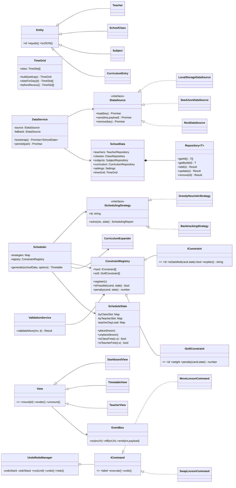

# ChronoSched — Architecture & Design Specification

> **Status:** Built (v1.0) — this document describes the code as it exists.
> **Stack:** HTML5 · CSS3 · Vanilla ES2022 modules · JSON · LocalStorage
> **Deploy target:** GitHub Pages (static, no backend, no build step)

---

## 0. Design Goals

| Goal | Mechanism |
|---|---|
| Maintainable for years | Strict layering, one class per file, documented public API |
| Extensible scheduling | Strategy + Constraint Registry (add rules without editing the solver) |
| Backend-ready | All data access behind async `IDataSource`; swap LocalStorage → REST |
| Testable | Domain + services have **zero** DOM references |
| Performant | Indexed occupancy maps, virtualised/diffed rendering, no full re-renders |

### The one non-negotiable rule

**Dependencies point inward.**

```
ui/  ──▶  services/  ──▶  domain/  ──▶  core/
 │                            ▲
 └──▶ managers/ ─────────────-┘
```

`domain/` may not import from `services/` or `ui/`.
`services/` may not import from `ui/`.
`ui/` never touches `localStorage` or `fetch` directly.

Violating this is the fastest way to make the project unmaintainable, so it is **machine-enforced**: `tools/verify-modules.mjs` walks every module, resolves every relative import and fails if any of these edges is crossed. It runs in CI before deployment, so a violating import cannot reach the live site.

The practical payoff is measurable: because `scheduling/` contains no DOM reference, the entire engine runs in Node in ~30ms (`npm run test:scheduler`). If that file ever needs a DOM shim, a layering rule has been broken.

---

## 1. Folder Structure

This is the tree **as built** — 102 modules under `js/`.

```
ChronoSched/
├── index.html                     # Shell; the only inline script applies the theme pre-paint
├── .nojekyll                      # Required: GitHub Pages must not run Jekyll
├── package.json                   # Script runner only — the app has zero dependencies
├── README.md
├── .github/workflows/deploy.yml   # Verify, then publish to Pages
│
├── docs/
│   └── ARCHITECTURE.md            # This file
│
├── tools/                         # Dev-only; never shipped to the browser
│   ├── verify-modules.mjs         # Parse + import/export integrity + layering
│   ├── generate-seeds.mjs         # Builds data/*.seed.json, proves it is schedulable
│   └── scheduler-smoke-test.mjs   # Runs the engine headlessly and audits its output
│
├── css/
│   ├── tokens.css                 # Structural tokens — spacing, radius, type, motion, z-index
│   ├── theme-light.css            # Colour token values, light
│   ├── theme-dark.css             # Colour token values, dark
│   ├── base.css                   # Reset, typography, app-shell grid, print styles
│   ├── components.css             # Buttons, cards, fields, tables, modals, toasts, chips
│   └── views.css                  # Screen-specific layout (dashboard, timetable grid, …)
│
├── vendor/                        # Committed, not CDN — the app must work offline
│   ├── xlsx.full.min.js           # SheetJS — Excel import/export
│   ├── jspdf.umd.min.js           # jsPDF — PDF export
│   └── jspdf.plugin.autotable.min.js
│
├── data/                          # Read-only seed JSON shipped with the build
│   ├── settings.seed.json
│   ├── classes.seed.json
│   ├── subjects.seed.json
│   ├── teachers.seed.json
│   └── curriculum.seed.json
│
└── js/
    ├── main.js                    # Composition root — the ONLY place that `new`s things
    │
    ├── core/                      # Framework-agnostic primitives; no domain knowledge
    │   ├── EventBus.js            # Observer pattern; injected, never a global
    │   ├── Result.js              # Ok/Err — expected failures are values, not exceptions
    │   ├── Entity.js              # Identity, serialisation and validation contracts
    │   ├── Registry.js            # Insertion-ordered, id-keyed, O(1) lookup
    │   └── Command.js             # Undoable-operation base
    │
    ├── domain/                    # Pure business objects. No DOM, no storage, no async.
    │   ├── Settings.js            # School day config + constraint weights
    │   ├── TimeSlot.js            # One period on one day (derived, never persisted)
    │   ├── TimeGrid.js            # Settings → the week; owns all grid time arithmetic
    │   ├── Teacher.js
    │   ├── SchoolClass.js
    │   ├── Subject.js             # Catalogue only — see §2.1
    │   ├── CurriculumEntry.js     # Subject × Class offering — the scheduler's real input
    │   ├── Lesson.js              # One placed period (value object)
    │   ├── Timetable.js           # One generated version + its report
    │   └── SchoolData.js          # Aggregate root; holds Registries, not Repositories
    │
    ├── scheduling/                # No DOM anywhere — runs in Node in ~30ms
    │   ├── Scheduler.js           # Facade: the subsystem's entire public surface
    │   ├── SchedulingContext.js   # Immutable inputs + precomputed lookups
    │   ├── ScheduleState.js       # Working grid with six O(1) occupancy indexes
    │   ├── LessonDemand.js        # One atomic placement to make
    │   ├── Placement.js           # Candidate: demand + slots + teacher
    │   ├── CurriculumExpander.js  # Rows → demands, ordered hardest-first (MRV)
    │   ├── SchedulingReport.js    # Coverage, shortfalls with reasons, quality breakdown
    │   ├── strategies/
    │   │   ├── ISchedulingStrategy.js   # Shared candidate generation + diagnosis
    │   │   ├── GreedyHeuristicStrategy.js
    │   │   ├── BacktrackingStrategy.js
    │   │   └── LocalSearchOptimizer.js  # Post-pass; not a strategy — see its header
    │   └── constraints/
    │       ├── IConstraint.js           # Both interfaces: hard filters, soft ranks
    │       ├── ConstraintRegistry.js
    │       ├── DefaultConstraints.js    # THE file to edit when adding a rule
    │       ├── hard/                    # Registered cheapest-first (short-circuiting)
    │       │   ├── ClassClashConstraint.js
    │       │   ├── TeacherClashConstraint.js
    │       │   ├── SubjectDailyCapConstraint.js
    │       │   ├── TeacherAvailabilityConstraint.js
    │       │   ├── TeacherDailyLoadConstraint.js
    │       │   └── TeacherWeeklyLoadConstraint.js
    │       └── soft/                    # Each maps to a weight slider in the UI
    │           ├── CorePeriodWindowConstraint.js
    │           ├── WeeklyDistributionConstraint.js
    │           ├── RecessSidePreferenceConstraint.js
    │           ├── DifficultySpreadConstraint.js
    │           ├── SubjectSpreadConstraint.js
    │           ├── TeacherGapConstraint.js
    │           ├── PreferredFreePeriodConstraint.js
    │           └── TeacherDailyBalanceConstraint.js
    │
    ├── data/
    │   ├── IDataSource.js         # The seam a FastAPI backend slots into
    │   ├── LocalStorageDataSource.js
    │   ├── SeedJsonDataSource.js  # Read-only; consulted on first run only
    │   ├── RestDataSource.js      # Working HTTP impl, NOT wired — proves §9
    │   ├── DataService.js         # Owns the source-of-truth policy
    │   ├── SchemaMigrator.js      # Versioned upgrades of stored payloads
    │   └── repositories/
    │       ├── Repository.js      # Generic CRUD + validation gate + persistence + events
    │       ├── TeacherRepository.js
    │       ├── ClassRepository.js
    │       ├── SubjectRepository.js
    │       ├── CurriculumRepository.js
    │       ├── TimetableRepository.js   # Append-only versioning lives here
    │       └── SettingsRepository.js    # Singleton; deliberately not a Repository
    │
    ├── services/
    │   ├── ValidationService.js   # Reuses the SAME registry as the scheduler
    │   ├── TimetableEditor.js     # validate → command → history → persist
    │   ├── SearchService.js
    │   └── transfer/
    │       ├── TransferService.js # Registry/factory for every import and export
    │       ├── IExporter.js
    │       ├── WorkbookSchema.js  # Shared by importer AND exporter — round-trip safety
    │       ├── ExcelExporter.js
    │       ├── ExcelImporter.js
    │       ├── PdfExporter.js
    │       └── JsonTransfer.js    # Full-fidelity backup/restore
    │
    ├── managers/
    │   ├── StorageManager.js      # Quota, private-browsing and corrupt-JSON handling
    │   ├── ThemeManager.js
    │   ├── UndoRedoManager.js
    │   └── ShortcutManager.js     # One keydown listener for the whole app
    │
    ├── commands/                  # Undoable timetable mutations
    │   ├── MoveLessonCommand.js   # Single period or a whole block, one code path
    │   ├── SwapLessonsCommand.js
    │   ├── AssignTeacherCommand.js
    │   ├── ClearLessonCommand.js
    │   └── SetLessonCommand.js    # + ToggleLockCommand (pinning)
    │
    ├── ui/                        # The only layer that touches the DOM
    │   ├── AppContext.js          # The injected service bundle
    │   ├── AppShell.js            # Nav, theme toggle, status bar, undo/redo
    │   ├── Router.js              # Hash routing (Pages-safe); owns view lifecycle
    │   ├── View.js                # Base: render/mount/unmount + automatic teardown
    │   ├── components/
    │   │   ├── Modal.js           # ModalHost: focus trap, Escape, confirm(), prompt()
    │   │   ├── Toaster.js
    │   │   ├── DataTable.js       # Sortable, delegated row actions
    │   │   ├── FormField.js       # Fields + the inline help-hint system
    │   │   ├── SlotPicker.js      # Week grid for unavailable / preferred-free
    │   │   └── SearchBox.js
    │   └── views/
    │       ├── EntityListView.js  # Template Method base for the four CRUD screens
    │       ├── DashboardView.js
    │       ├── TeacherView.js
    │       ├── ClassView.js
    │       ├── SubjectView.js
    │       ├── CurriculumView.js
    │       ├── TimeConfigView.js
    │       ├── GenerateView.js
    │       ├── TimetableView.js   # Grid, drag/drop, versions, compare, export
    │       └── SettingsView.js
    │
    └── utils/
        ├── Constants.js           # Enums, keys, routes, limits — no magic values elsewhere
        ├── TimeUtils.js
        ├── DomUtils.js            # el(), delegate(), fragment() — the whole "framework"
        ├── ArrayUtils.js
        ├── IdGenerator.js
        └── Logger.js
```

### Where the build diverged from this plan, and why

| Planned | Shipped | Reason |
| --- | --- | --- |
| `services/import/` + `services/export/` | one `services/transfer/` | Importer and exporter must share `WorkbookSchema.js` or an exported file cannot be re-imported. Splitting them across two folders hid that dependency. |
| `components/HelpHint.js` | folded into `FormField.js` | Every hint is attached to a field. A separate module meant a caller could build a field and forget the hint — the exact requirement most at risk of being skipped. |
| `views/VersionCompareView.js` | folded into `TimetableView` | Comparison needs the same version list and slot labels. As a route it duplicated both; as a dialog it reuses them. |
| `commands/EntityEditCommand.js` | not built | Ctrl+Z on the timetable is expected; Ctrl+Z silently resurrecting a deleted teacher is not. Entity edits go through repositories with confirmation instead, and the delete dialog says so. |
| `constraints/hard/RoomTypeConstraint.js` | not built | Rooms are not in the data model yet. Adding it later is one file plus one line — which is the point of the registry. |
| — | `+ TeacherDailyBalanceConstraint` | Without it, an unpinned subject piles onto whichever teacher was checked first. |
| — | `+ SettingsRepository`, `+ TimetableEditor`, `+ EntityListView`, `+ AppContext`, `+ AppShell` | Emerged from the build; each is documented in its own header. |

### Why this differs from the sketch in the brief

| Change | Reason |
|---|---|
| `models/` → `domain/` | Signals "business rules live here", not "dumb DTOs" |
| `Class.js` → `SchoolClass.js` | `Class` is legal JS but shadows a core concept and reads terribly in every import |
| Added `core/` | EventBus/Result/Entity are infrastructure, not domain — mixing them rots the domain layer |
| Split `scheduling/` out of `services/` | It is the largest subsystem in the app (~15 files). Burying it in `services/` guarantees a future god-file |
| Added `constraints/` | The Open/Closed seam. New rule = new file + one registry line. **The solver is never edited again.** |
| Added `commands/` | Undo/redo via Command pattern needs a home; scattering them into services breaks SRP |
| `json/` → `data/*.seed.json` | Renamed to make it unambiguous these are **read-only seeds**, not the live store |
| Added `repositories/` | Isolates "collection semantics" from "persistence mechanism" — the backend swap point |
| One CSS file → tokens + themes + layers | A single `style.css` is the CSS equivalent of a god-file; theming needs a token layer anyway |

---

## 2. Data Models

### 2.1 The most important modelling decision

The brief describes Subject as *"Name **and Class it belongs to**, Periods per day, Before recess, Requires consecutive, Lab/Theory, **Teacher assignment**"*.

That bundles two different things into one entity:

- **Subject** — "Mathematics", "Physics Lab". Shared across the whole school.
- **The offering of that subject to one class** — "10A gets Mathematics, 6 periods/week, taught by T-014, prefer before recess".

If we keep them merged, "Mathematics" is duplicated once per class. Renaming it means editing 12 rows; a typo silently splits it into two subjects; and Teacher.subjects becomes meaningless.

**Decision: split into `Subject` (catalog) + `CurriculumEntry` (offering).**

```
Subject 1 ──────< CurriculumEntry >────── 1 SchoolClass
                        │
                        └──── 0..1 Teacher (assigned)
```

Every scheduling requirement in the brief is a property of the *offering*, not the subject — which is exactly the evidence that the split is correct.

### 2.2 Entity definitions

```js
Subject {
  id            : string        // "sub_math"
  name          : string        // "Mathematics"
  shortName     : string        // "MAT" — for grid cells
  type          : SubjectType   // THEORY | LAB | ACTIVITY
  difficulty    : 1..5          // drives DifficultySpreadConstraint
  colorToken    : string        // "--subject-1" (theme-aware, not a hex)
}

SchoolClass {
  id            : string        // "cls_10a"
  name          : string        // "10A"
  section       : string|null   // "A"
  gradeLevel    : number        // 10
  studentCount  : number|null
  roomId        : string|null   // home room (future)
}

Teacher {
  id                 : string
  employeeId         : string           // human-facing, unique
  name               : string
  subjectIds         : string[]         // qualifications
  classIds           : string[]         // eligible classes ([] = any)
  maxPeriodsPerDay   : number
  maxPeriodsPerWeek  : number
  unavailableSlots   : SlotRef[]        // HARD — never schedule
  preferredFreeSlots : SlotRef[]        // SOFT — avoid if possible
}

CurriculumEntry {                        // ← the scheduler's real input
  id                 : string
  classId            : string
  subjectId          : string
  teacherId          : string|null       // null = auto-assign from qualified pool
  periodsPerWeek     : number            // authoritative count
  maxPerDay          : number            // default 1 theory / 2 lab
  priority           : Priority          // CORE | ELECTIVE | CO_CURRICULAR
  recessPreference   : RecessSide        // BEFORE | AFTER | ANY
  requiresConsecutive: boolean
  consecutiveBlock   : number            // 2 = double period
}

TimeSlot {                               // generated, never hand-authored
  id            : string        // "d0p3"
  dayIndex      : number        // 0 = Monday
  periodIndex   : number        // 0-based teaching index
  periodLabel   : string        // "3"
  startTime     : string        // "09:40"
  endTime       : string        // "10:20"
  kind          : SlotKind      // TEACHING | RECESS | ASSEMBLY
  isBeforeRecess: boolean
}

Lesson {                                 // one placed cell
  slotId        : string
  classId       : string
  subjectId     : string
  teacherId     : string|null
  locked        : boolean       // manual edits survive regeneration
  blockId       : string|null   // groups consecutive periods of one block
}

Timetable {                              // IMMUTABLE once created
  id            : string
  version       : number        // 1, 2, 3 …
  label         : string        // "Version 3 — after Sharma's leave"
  createdAt     : ISO string
  strategyId    : string        // which algorithm produced it
  settingsHash  : string        // detects "generated under old timings"
  lessons       : Lesson[]
  report        : SchedulingReport
}
```

### 2.3 Assumptions taken (override any of these)

| Brief says | Interpreted as | Why |
|---|---|---|
| Subject has "Periods per day" | `periodsPerWeek` + `maxPerDay` | A subject with 3 periods/week cannot be expressed per-day; "distribute evenly across the week" is inherently weekly. The UI still offers a "× days" helper that writes `periodsPerWeek`. |
| "Main subjects continuously from 1st to 6th period" | `priority: CORE` + soft `CorePeriodWindowConstraint` with a **configurable** window `settings.corePeriodWindow = {from:1, to:6}` | `1..6` hard-coded is a magic number that breaks any school with 7 periods. As a *hard* constraint it makes most inputs infeasible (7 core periods can't fit in 6 slots). Soft + weighted gets the same result without deadlocking. |
| "Teacher: classes they can teach" **and** "Subject: teacher assignment" | Both kept; `Teacher.classIds/subjectIds` = *eligibility*, `CurriculumEntry.teacherId` = *the actual assignment* | Eligibility filters the dropdown and powers auto-assign; assignment is the fact. ValidationService flags assignments that violate eligibility. |
| Days of the week | New `settings.workingDays: string[]` | The brief's Time Configuration omits days entirely, but a weekly timetable is meaningless without them. |

---

## 3. Class Diagram



**Read the arrows:** nothing in `domain/` or `scheduling/` points at `ui/`. That is what makes the scheduler unit-testable in Node with no DOM, and what lets a FastAPI backend reuse the exact same constraint classes later.

---

## 4. JSON Schema


Every payload — seed file and stored value alike — uses the same envelope:

```jsonc
{ "schemaVersion": 1, "data": <object | array> }
```

One shape everywhere means `SchemaMigrator` has exactly one thing to understand,
and a hand-edited file cannot half-match the format. The migrator also accepts a
bare object or array without the envelope, because people do hand-edit these.

### 4.1 Seed files (`data/*.seed.json`) — shipped, read-only

```jsonc
// data/settings.seed.json
{
  "schemaVersion": 1,
  "data": {
    "school": { "name": "Springfield Public School", "academicYear": "2026-27" },
    "workingDays": ["Mon", "Tue", "Wed", "Thu", "Fri", "Sat"],
    "dayStart": "08:00",
    "periodDurationMinutes": 40,
    "periodCount": 8,
    "breaks": [
      { "afterPeriod": 4, "label": "Recess",      "durationMinutes": 20, "isRecess": true  },
      { "afterPeriod": 6, "label": "Short Break", "durationMinutes": 10, "isRecess": false }
    ],
    "corePeriodWindow": { "from": 1, "to": 6 },
    "constraintWeights": {
      "corePeriodWindow": 10,
      "recessSidePreference": 6,
      "teacherGap": 4,
      "preferredFreePeriod": 3,
      "difficultySpread": 5,
      "subjectSpread": 5,
      "teacherDailyBalance": 2
    }
  }
}
```

```jsonc
// data/teachers.seed.json
{
  "schemaVersion": 1,
  "data": [
    {
      "id": "tch_eng1",
      "employeeId": "EMP-1001",
      "name": "Anita Sharma",
      "subjectIds": ["sub_eng"],
      "classIds": [],                                          // empty = any class
      "maxPeriodsPerDay": 6,
      "maxPeriodsPerWeek": 28,
      "unavailableSlots":   [{ "dayIndex": 5, "periodIndex": null }],  // null = whole day
      "preferredFreeSlots": []
    }
  ]
}
```

```jsonc
// data/curriculum.seed.json — the scheduler's actual input
{
  "schemaVersion": 1,
  "data": [
    {
      "id": "cur_10a_mat",
      "classId": "cls_10a",
      "subjectId": "sub_mat",
      "teacherId": "tch_mat1",        // null asks the scheduler to choose
      "periodsPerWeek": 7,
      "maxPerDay": 2,                 // HARD: 7/week cannot fit 6 days at 1/day
      "priority": "CORE",
      "recessPreference": "BEFORE",
      "requiresConsecutive": false,
      "consecutiveBlock": 1
    },
    {
      "id": "cur_11a_phl",
      "classId": "cls_11a",
      "subjectId": "sub_phl",
      "teacherId": "tch_phy1",
      "periodsPerWeek": 2,
      "maxPerDay": 2,
      "priority": "ELECTIVE",
      "recessPreference": "AFTER",
      "requiresConsecutive": true,
      "consecutiveBlock": 2           // one double period, never split
    }
  ]
}
```

`data/classes.seed.json` and `data/subjects.seed.json` follow the same
`{ schemaVersion, data: [...] }` shape, holding the fields listed in §2.2.

The bundled demo school is generated and load-checked rather than hand-written:
`tools/scheduler-smoke-test.mjs` fails if any class is over capacity, any
teacher is over their cap, or any subject cannot fit at its declared daily
maximum.

### 4.2 Persisted state (LocalStorage) — the live store

One key per aggregate, all prefixed, all carrying the same envelope:

```
chronosched:v1:settings
chronosched:v1:teachers
chronosched:v1:classes
chronosched:v1:subjects
chronosched:v1:curriculum
chronosched:v1:timetables      → data: Timetable[] (each with its report)
chronosched:v1:preferences     → data: { theme, activeTimetableId }
```

Splitting by aggregate rather than storing one blob means editing a teacher does
not rewrite the entire timetable history on every keystroke.

**`schemaVersion` on every payload is not optional.** Once this app holds a real
term's timetable, "the data model changed so we cleared your storage" stops
being acceptable. `SchemaMigrator` holds an ordered list of
`{ from, to, migrate(data, key) }` steps and runs them on load. The list is
empty at v1 — the seam is the point, not the contents — and it costs about
thirty lines today against a data-loss incident later.

### 4.3 Source-of-truth policy

```
First run  : seeds → validate → hydrate → persist to LocalStorage
Later runs : LocalStorage is authoritative; seeds ignored
Reset      : explicit "Restore demo data" action in Settings only
```

`DataService.bootstrap()` implements exactly this, and it is the *only* place the rule lives.

---

## 5. Scheduling Architecture

### 5.1 Constraint classification

This split drives everything. **Hard = filter. Soft = rank.**

| Constraint | Type | Notes |
|---|---|---|
| Teacher not in two places at once | **HARD** | O(1) map lookup |
| Class not doing two subjects at once | **HARD** | O(1) map lookup |
| Teacher unavailable period | **HARD** | |
| Teacher max periods/day and /week | **HARD** | |
| Subject `maxPerDay` cap | **HARD** | Prevents 6 maths on Monday |
| Lab consecutive block stays intact | **HARD** | Placed as an atomic block, not per-period |
| `periodsPerWeek` fully satisfied | **HARD (goal)** | Unmet demand → reported, not silently dropped |
| Core subjects inside periods 1–6 | *soft* | weight 10 |
| How often a subject runs across the week | *soft* | weight 8 |
| Before/after-recess preference | *soft* | weight 6 |
| No teacher gaps (free period between classes) | *soft* | weight 4 |
| Teacher preferred free periods | *soft* | weight 3 |
| Difficult subjects spread across week | *soft* | weight 5 |
| Same subject not clustered on one day | *soft* | weight 5 |

Weights live in `settings.constraintWeights` — the administrator can retune priorities from the Settings screen **without a code change**. That is the Open/Closed Principle paying rent.

### 5.2 Pipeline

```
SchoolData
   │
   ├─▶ TimeGrid.build(settings)              → TimeSlot[]  (teaching slots only)
   │
   ├─▶ CurriculumExpander                    → LessonDemand[]
   │      6 periods/week, block=1  → 6 demands of size 1
   │      4 periods/week, block=2  → 2 demands of size 2  (atomic!)
   │
   ├─▶ DemandOrderer  (MRV — most-constrained-first)
   │      score = blockSize×100 + priorityWeight + (1/teacherFreedom)
   │      → labs & tightly-constrained teachers get first pick of the grid
   │
   ├─▶ ISchedulingStrategy.solve(ctx, state)
   │      for each demand:
   │        candidates = allSlots
   │          .filter(hard constraints)       ← ConstraintRegistry.isFeasible
   │          .sort(by soft penalty asc)      ← ConstraintRegistry.penalty
   │        place best; on dead-end → backtrack (Backtracking strategy)
   │                                 or record unplaced (Greedy strategy)
   │
   ├─▶ LocalSearchOptimizer (optional pass)
   │      repeatedly try swaps that lower total soft penalty; keep if better
   │
   └─▶ Timetable (new immutable version) + SchedulingReport
```

### 5.3 `ScheduleState` — why the timetable is stored three ways

Naively checking "is teacher T free at slot S?" by scanning all lessons is O(n) inside the hottest loop in the app, giving roughly O(demands × slots × lessons) ≈ millions of operations for a mid-size school.

`ScheduleState` maintains redundant indexes, all updated in `place()`/`unplace()`:

```js
byClassSlot   : Map<`${classId}|${slotId}`,   Lesson>   // class clash    → O(1)
byTeacherSlot : Map<`${teacherId}|${slotId}`, Lesson>   // teacher clash  → O(1)
teacherDayLoad: Map<`${teacherId}|${day}`,    number>   // daily cap      → O(1)
subjectDayLoad: Map<`${classId}|${subId}|${day}`, number> // maxPerDay    → O(1)
```

Feasibility check drops to **O(#hardConstraints)** — constant. This single decision is the difference between a generator that runs in ~50 ms and one that hangs the browser tab.

### 5.4 Strategy Pattern — what each one is for

| Strategy | Guarantee | Speed | Use when |
|---|---|---|---|
| `GreedyHeuristicStrategy` | None; reports unplaced demands | Very fast | Live preview, loose constraints, first look |
| `BacktrackingStrategy` | Complete within a node budget | Slower | The real generate button |
| `LocalSearchOptimizer` | Improves an existing solution | Tunable | Post-pass on either of the above |

They share `SchedulingContext`, `ScheduleState`, and the constraint registry, so adding a fourth (genetic, simulated annealing) means implementing **one interface method** and registering it. `Scheduler` never changes.

### 5.5 Regeneration & versioning

`TimetableRepository` is **append-only**. `generate()` always mints `version = nextVersion++` and never mutates an existing `Timetable`. `Lesson.locked` lets an admin pin manual fixes and regenerate around them. Deletion is a separate, explicit, confirmed operation.

### 5.6 Manual editing reuses the solver's brain

`ValidationService.validateMove()` builds a candidate placement and runs it through **the same `ConstraintRegistry`**. Drag-and-drop therefore cannot produce a state the generator considers illegal, and there is exactly one definition of "legal" in the codebase. Hard violations block the drop with an explanation (`IConstraint.explain()`); soft violations allow it with a warning badge.

---

## 6. UI Wireframe

### 6.1 Shell (desktop ≥ 1024px)

```
┌──────────────────────────────────────────────────────────────────────────┐
│  ⏱ ChronoSched        [ 🔍 Search teacher / subject / class      ]  ☾ ⚙ │
├───────────────┬──────────────────────────────────────────────────────────┤
│  Dashboard    │                                                          │
│  Teachers     │   ┌── VIEW OUTLET ─────────────────────────────────────┐ │
│  Classes      │   │                                                    │ │
│  Subjects     │   │                                                    │ │
│  Curriculum   │   │                                                    │ │
│  Time Config  │   │                                                    │ │
│  Generate     │   │                                                    │ │
│  Timetables   │   └────────────────────────────────────────────────────┘ │
│  Settings     │                                                          │
├───────────────┴──────────────────────────────────────────────────────────┤
│  ↶ Undo   ↷ Redo        Saved locally · 14:22          v3 (active)       │
└──────────────────────────────────────────────────────────────────────────┘
```

Mobile (< 768px): sidebar collapses to a bottom tab bar; the timetable grid switches from *week matrix* to *day-by-day accordion* (a 6×8 matrix is unreadable on a phone — this is a layout change, not just a media query).

### 6.2 Dashboard

```
┌──────────┐ ┌──────────┐ ┌──────────┐ ┌──────────┐
│    24    │ │     8    │ │    17    │ │     3    │
│ Teachers │ │ Classes  │ │ Subjects │ │ Versions │
└──────────┘ └──────────┘ └──────────┘ └──────────┘

▸ Quick actions
[ Current Timetable ] [ Generate ] [ Import Excel ] [ Export ▾ ] [ Settings ]

▸ Health check
⚠ 2 classes have fewer curriculum periods than the week has slots
⚠ Teacher "R. Iyer" is assigned 31 periods but her weekly cap is 26
```

The health check turns invisible data problems into visible ones *before* the admin clicks Generate and gets a confusing failure.

### 6.3 Timetable view

```
View: (•) By Class  ( ) By Teacher      Class: [ 10A ▾ ]   Version: [ v3 ▾ ]  [Compare]

        Mon        Tue        Wed        Thu        Fri        Sat
  P1  ┌────────┐ ┌────────┐ …
      │ MATH   │ │ ENG    │        ← draggable cell
      │ Sharma │ │ Rao    │
      └────────┘ └────────┘
  P2  …
 ═══════════════ RECESS 10:20–10:40 ═══════════════
  P5  …
      ┌─────────────────┐
      │ PHYSICS LAB     │  ← 2-period block, drags as one unit
      │ Iyer            │
      └─────────────────┘
```

`By Teacher` renders the same `Lesson[]` pivoted on `teacherId` — one data structure, two projections, zero duplicated rendering logic.

### 6.4 Inline guidance (the "user guide along the way" requirement)

Every non-obvious control gets a `HelpHint` beneath it — small, low-contrast, plain English, always with a concrete example:

```
Requires consecutive periods   [✓]
  ↳ Keeps this subject's periods back-to-back. Example: Physics Lab with
    2 periods will always be scheduled as P5+P6 together, never split
    across the day.

Maximum periods per day        [ 5 ]
  ↳ The most classes this teacher can take in one day. Example: set 4 and
    Mrs. Sharma will never appear in more than 4 periods on any day, even
    if her subjects need more.
```

Styled via `--text-muted` at `0.8125rem` — present when scanned for, invisible when not.

---

## 7. Build Order and Verification

Each module was built and verified before the next began, so no step depended on
one that did not yet work.

| # | Module | Verified by |
| --- | --- | --- |
| 1 | `core/` + `utils/` + shell + CSS tokens/themes | App boots; theme persists across reload |
| 2 | `domain/` entities + `TimeGrid` | Entity validation; grid geometry |
| 3 | `data/` — storage, sources, repositories, migrator, seeds | Seed generator asserts the demo school is feasible |
| 4 | `scheduling/` — constraints, state, expander, strategies | `scheduler-smoke-test.mjs`, headless |
| 5 | `services/`, `managers/`, `commands/` | Exercised through the UI end-to-end run |
| 6 | `ui/` — router, components, nine views | Browser end-to-end: every route mounts |
| 7 | `main.js` composition root | App starts with zero console errors |
| 8 | GitHub Pages deployment | CI runs steps 3–4 before publishing |

### What the checks actually assert

`npm run verify` — 102 modules parsed; every relative import resolves; every
named binding exists in its target module; no layering edge is crossed.

`npm run test:scheduler` — on the bundled demo school (6 classes, 220 periods a
week), independently re-auditing the produced grid rather than trusting the
solver's own indexes:

```text
placed                                224/224 (100%)
core periods inside window 1–6        176/176 (100%)
"every day" subjects on all six days   20/20
twice-a-week subjects on apart days      6/6
hard-constraint violations                 0
time                                    32 ms
reproducible with a fixed seed           yes
different output with a new seed         yes
complete across 15 different seeds     15/15
```

An over-subscribed variant (every teacher capped at 6 periods a week) returns
106/224 in 2.8s with a per-row reason — it degrades and reports rather than
hanging or silently dropping periods.

A browser run through the DevTools Protocol additionally confirmed: all nine
routes mount; generation from a real button click places 220/220; the grid
renders 48 cells with 2 break rows; a drag marks 30 legal and 18 illegal targets
before the pointer moves; a real drop moves the lesson and Ctrl+Z restores it;
an illegal drop is refused with a message; regeneration produces a second
version without touching the first; theme and data survive a reload; and no
console errors occur throughout.

---

## 8. Deployment Notes (GitHub Pages)

Three things that silently break static ES-module apps on Pages:

1. **`.nojekyll` at repo root** — without it, Jekyll strips paths beginning with `_`.
2. **Relative paths only.** Pages serves from `https://user.github.io/ChronoSched/`. A leading `/js/main.js` resolves to the domain root and 404s. Use `./js/main.js`.
3. **`file://` will not work locally.** ES modules and `fetch()` of the seed JSON are both blocked by CORS on the file protocol. Local dev requires `python3 -m http.server 8000`. This is documented in the README rather than worked around, because the workaround (inlining seeds as JS) would sacrifice the JSON-file requirement.

Vendored libs (SheetJS, jsPDF) are committed to `vendor/` rather than pulled from a CDN so the app works offline in a school with unreliable internet — which is the actual deployment environment.

---

## 9. Backend-Readiness

When FastAPI + PostgreSQL arrives, the entire change is:

1. Implement `RestDataSource` against the existing `IDataSource` interface.
2. Change one line in `main.js`:
   ```js
   const source = new RestDataSource(API_BASE);   // was LocalStorageDataSource
   ```

This works **only because every data method is `async` from day one**, even though LocalStorage is synchronous. Writing synchronous repository methods now would force rewriting every call site in every view later. The `async` keyword on a synchronous implementation is the cheapest future-proofing available.

The constraint classes are pure functions over plain data, so a Python port can mirror them one-to-one, or the Node build can be reused server-side unchanged.
